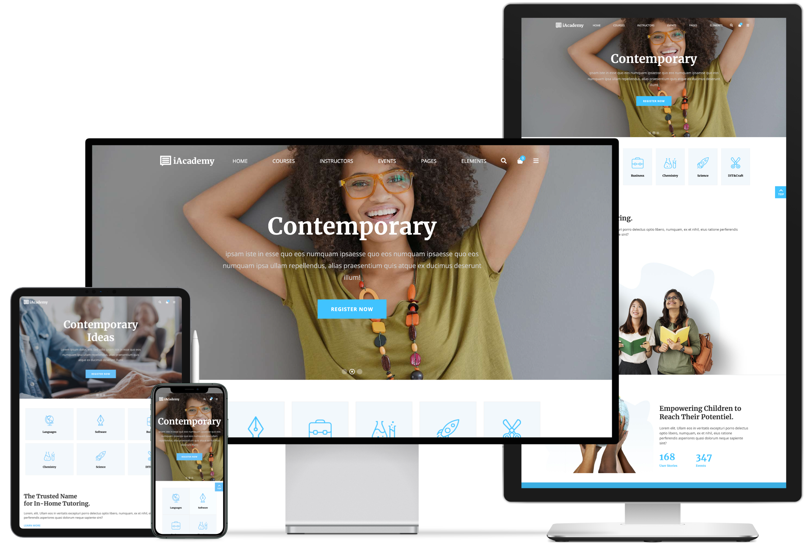

 

<h2 align="center">VueJS Project</h2>

---

This landing page has been assigned as a task to replicate it from a PNG screen

  
    
## ⛏️ Built With 

- [HTML](https://html.com) - Page Structure
- [CSS](https://www.w3.org/TR/CSS/) - Page Style & responsive
- [JavaScript](https://www.javascript.com) - Logic
- [VueJS](https://www.javascript.com) - Framework

## ✍️ Authors 

- [@IvanDF](https://github.com/IvanDF) - Design & Develop

See also my [website!](https://ivandf.dev)
New one is in progress.
